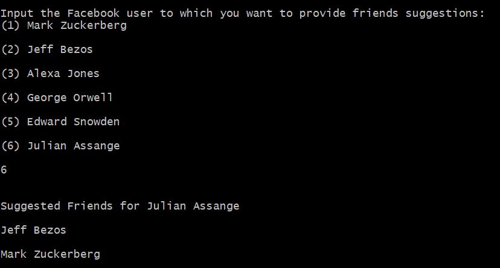

# Facebook Friend Suggestions
### Software Engineering Project 1: Assignment 1, UCD BSc. Computer Science 1st Year
A basic C program that suggests new friends for Facebook users based on the number of friends of the potential suggestions. This was an individual Assignment.

## Getting Started
1. Download the repository as a zipped file.
2. Unzip the repository.
3. Compile the following 4 files using this command: **gcc main.c input.c ordering.c suggestions.c**
4. Run the executable: **./a**

## Contents
- **main.c:** Contains the driver code for the program.
- **input.c:** Contains the code that asks the user to provide as input the friends of a Facebook user.
- **ordering.c:** Using selection sort, orders suggestions according to number of their friends. If they have the same number of friends order alphabetically.
- **suggestions.c:** Contains the code that decides who are the suggestions for the selected user.
- **prototypes.c:** Header file that contains the functions' prototypes.

## The Program

- Program is ran, you enter the name of the first user then input their friends. Repeat for all six users.
- Each user has a maximum of 4 friends 
- You then select the user you want to get friends suggestions for and they are displayed.

Problem Specification can be found [here.](https://docs.google.com/document/d/1NfRtzl-IRb-Ubu7RJvzIm9wY-gXtb6pxxenbYJtyaXM/edit#heading=h.cjxwdc55cy8r)
## Author
- Ahmed Jouda
